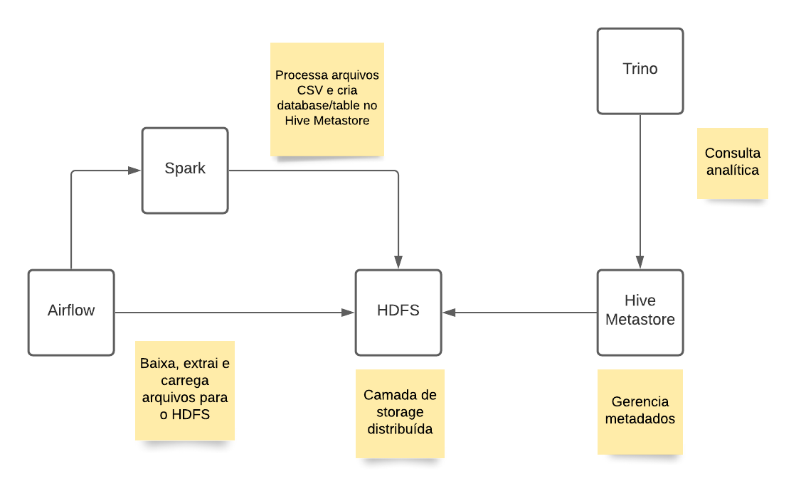

# Censo Escolar

## Arquitetura



- HDFS pela natureza distribuída e tolerante a falhas e usado de base pelo Apache Hadoop.
- Hive Metastore pela capacidade de armazenar metadados das estrutura, localização, partições etc e também pela compatibilidade com HDFS.
- Spark pela natureza distribuída, por usar uma técnica de processamento in-memory que reduz significativamente o tempo de processamento e pela interface com Python, PySpark que auxilia na escrita de scripts simples.
- Trino pela natureza distribuída, focada em consultas low-latency pela técnica de processamento in-memory e semântica SQL ANSI.

### Pontos de melhoria

- Adicionar dag no Apache Airflow para fazer a extração e carregamento dos dados no HDFS
- Subir o dado bruto total para reprocessamento
- Dependendo da demanda, frequência e criticidade para geração do relatório substituir o Trino por Apache Hive, assim, _suportará maior carga de dados a ser processado_ porém terá um tempo de processamento maior, por usar MapReduce (in disk)
- Alterar a camada de storage (HDFS) por um serviço gerenciado que ainda mantenha a compatibilidade com as ferramentas utilizadas, por exemplo, AWS S3

Observação: das tecnologias utilizadas, leva-se em conta migrar para um ambiente gerenciado a fim de minimizar preocupações com infra-estrutura.

## Schema

### Tabela censo.alunos

| Coluna          | Tipo    |
| --------------- | ------- |
| ID_ALUNO        | INTEGER |
| CO_MUNICIPIO    | INTEGER |
| CO_UF           | INTEGER |
| TP_COR_RACA     | INTEGER |
| TP_ETAPA_ENSINO | INTEGER |

A escolha foi manter todos os dados em somente uma tabela para otimização da leitura dos dados. Foi escolhido o formato Apache Parquet para compactação dos dados, e armazenamento do schema, partições e outros metadados que otimizam a leitura.

A decisão de particionar a tabela por Etapa de ensino foi tomada para otimizar a consulta do Passo 3 - requisito 1.

### Colunas adicionais

- IN_PROFISSIONALIZANTE e CO_REGIAO para saber as distribuição de pessoas por região que estão em cursos profissionalizantes
- TP_LOCALIZACAO para fazer um estudo de necessidades por tipo de localização

## Setup

O setup foi baseado na infra-estrutura usada pelo meu projeto de graduação que pode ser visualizado [aqui](https://github.com/jasondavindev/open-dataplatform).

Em todos os componentes, há um arquivo `docker-compose.yml` que facilita subir os containers das aplicações.

Para facilitar, listado os passos para subir o ambiente:

```bash
# Baixe o arquivo do Censo Escolar
# Extraia os arquivos CSV
# Suba os containers do HDFS
cd hdfs && docker-compose up

# Mova os arquivos necessários (MATRICULA_*) para dentro do container
docker cp pasta_arquivos_matricula namenode:/tmp/matricula

# Crie as pastas necessárias
cd hdfs && make mkdir dir=/spark/data/matricula flags="-p"; \
make mkdir dir=/user/hive/warehouse flags="-p"; \
make mkdir dir=/tmp

# Mova os arquivos para dentro do HDFS
cd hdfs && make cpFromLocal /tmp/matricula /spark/data/

# Suba os outros components
cd hive && docker-compose up hive-metastore
cd spark && docker-compose up
cd trino && docker-compose up

# Importe o script spark para dentro do HDFS
cd spark && make import_script file=pasta_do_projeto/spark/transform.py

# Execute o script spark
cd spark && make run_script script=transform.py  args="--database=censo --table=alunos --csv-path=/spark/data/matricula --dwh-table-path=hdfs://namenode:8020/user/hive/warehouse/censo"

# Abra o SQLPad para executar as consultas no Trino
# Rota http://localhost:3000
```

Observação: no resultado da segunda consulta, mantive os códigos identificadores pois não encontrei uma correlação na documentação fornecida.
